Данный html-макет был создан по шаблону aironepage. 
Это был мой первый опыт прикладного использования данных технологий.
Используемые материалы: html и css.
С использованием google fonts & google icons

Шаблон подстроен как под экран компьютера, так и под вертикальный, телефонный формат. 
Интегрирована карта Яндекс. 

Ниже представлены скриншоты страницы на экране ноутбука и на экране телефона.

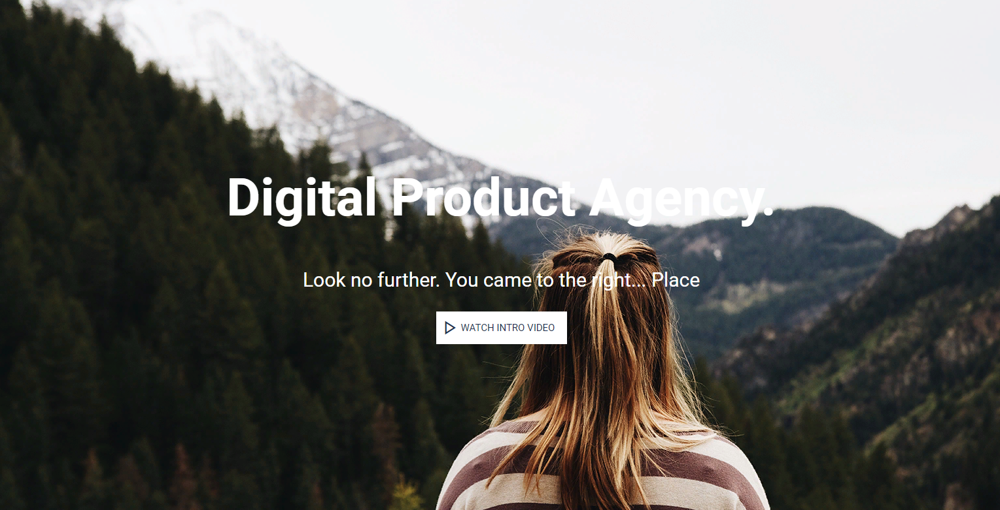 

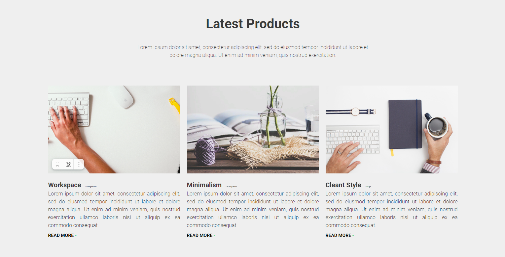 

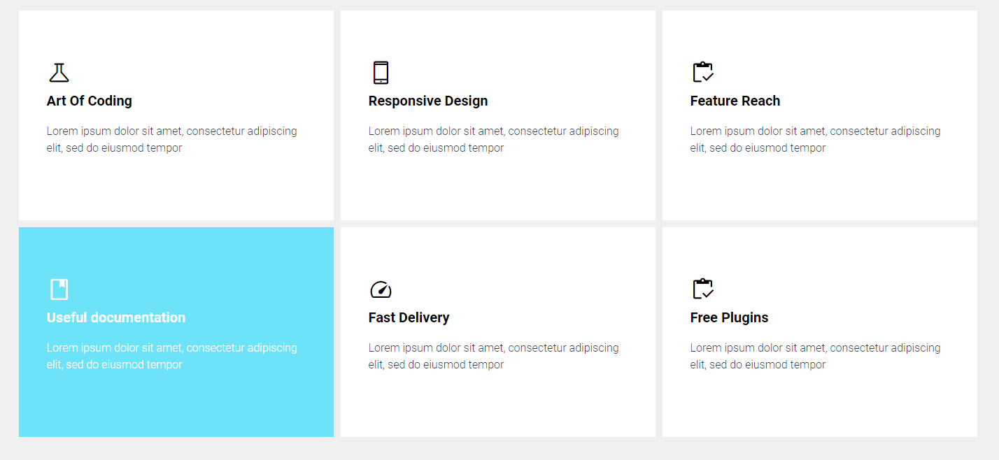 

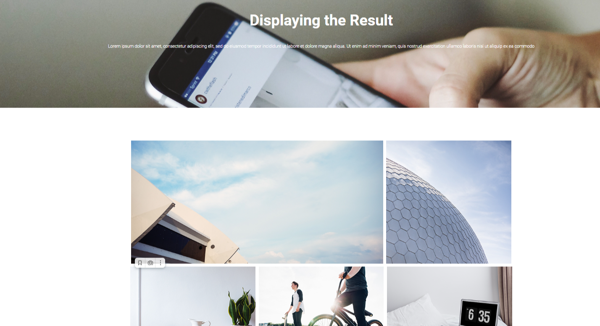 

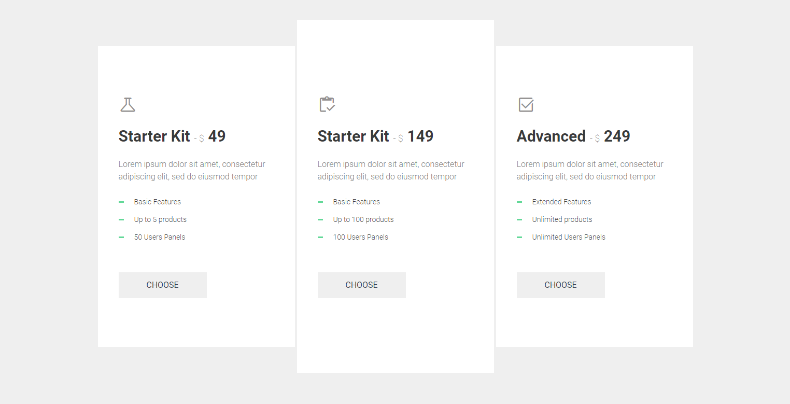 

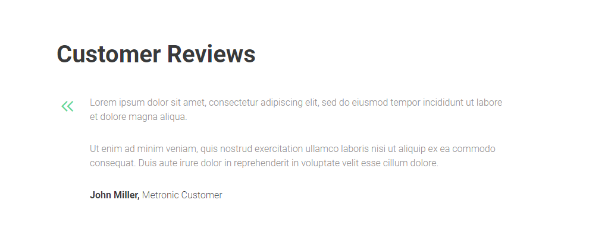

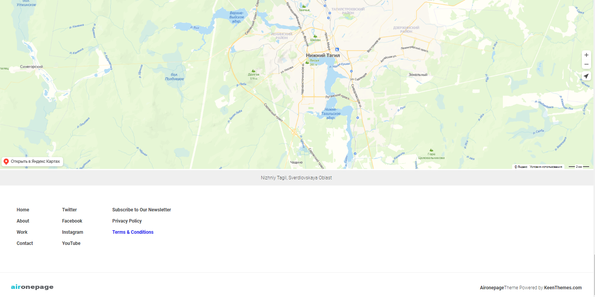 

Мобильный вид. Открывать можно через VS Live Server.

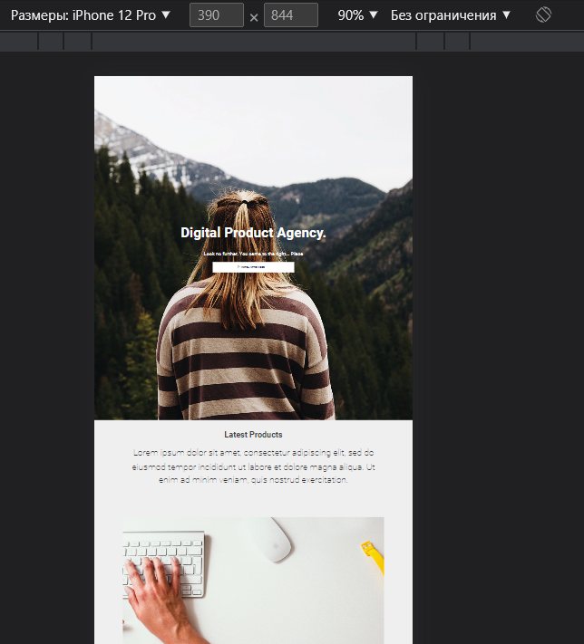 

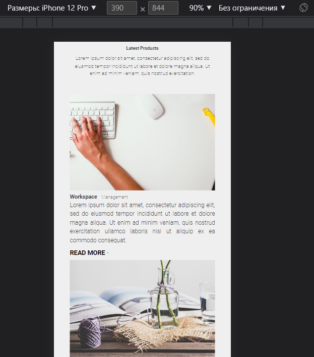 

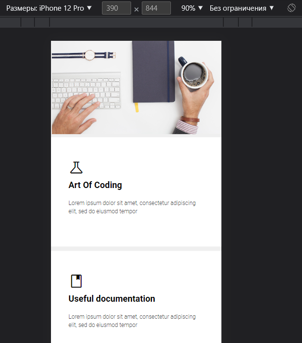 

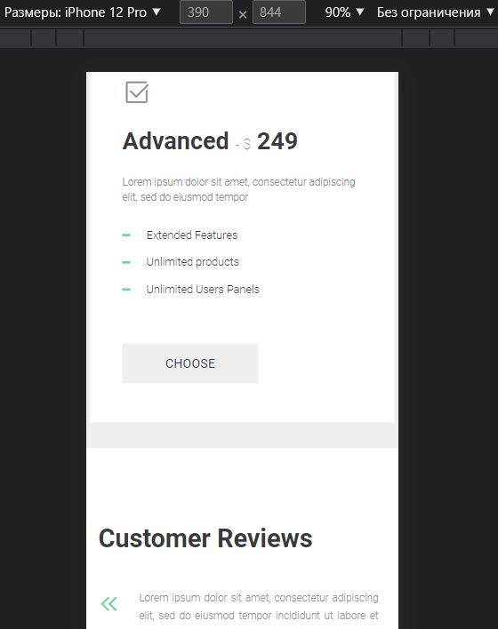

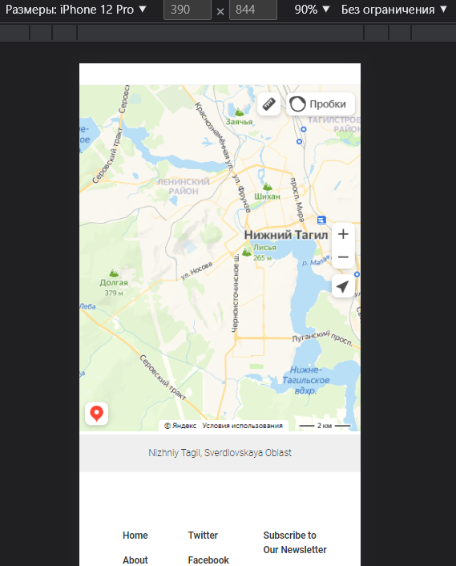 

Демонстрация работы мобильного вида на видео 😊

https://github.com/hellbruh/html-template-1/assets/97295264/8ee10661-e2d0-4fc7-a5cc-a244416bf6bc
